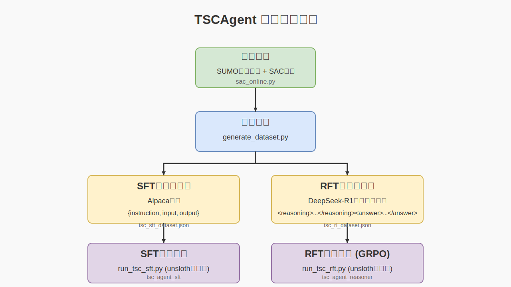

# TSCAgent: LLM-based Traffic Signal Control

## 项目概述

TSCAgent是一个基于大语言模型的交通信号控制系统，通过监督微调(SFT)和奖励微调(RFT)两种方式训练模型，实现智能交通信号控制。（一个demo，待优化，现有缺点：1.推理模型更高效的训练；2.没有考虑多交叉口协作。）

### 项目工作流程

下图展示了TSCAgent项目的完整工作流程，从数据采集、处理到模型训练和部署：



### 数据来源

- 基于成都市路网的SUMO仿真环境
- 使用SAC强化学习算法生成训练数据
- 动作空间：相位选择
- 奖励函数：车辆排队长度
- 状态特征（路口的交通状况）：

| 特征     | 描述                         | 示例值                             |
| -------- | ---------------------------- | ---------------------------------- |
| 相位信息 | 相位数量、当前相位、持续时间 | 4, [0,1,0,0], 10s                  |
| 交通状态 | 压力、绿灯状态               | 4辆车, 0                           |
| 车道信息 | 车道数量、特征统计[车道长度、数量、队列长度、速度、距离] | 2, [250m, 2辆, 1.5辆, 10m/s, 4.5m] |

### 模型运行：
```
# 建议在colab上运行
python run_tsc_sft.py
python run_tsc_rft.py
```

### 数据和模型保存地址
- 数据集地址：[tsc-datasets](https://huggingface.co/datasets/jiam/tsc-datasets)
- 指令微调模型：[tsc_agent_sft](https://huggingface.co/jiam/tsc_agent_sft)
- 推理模型：[tsc_agent_reasoner](https://huggingface.co/jiam/tsc_agent_reasoner)

## 技术方案

### 1. 模型选择

- 指令微调模型：Qwen/Qwen2.5-7B-Instruct
- 推理模型：DeepSeek-R1-Distill-Qwen-1.5B（计算资源受限）

### 2. 训练数据

- SFT：1000条高质量样本
- RFT：1000-3000条样本
- 数据格式：统一模板，包含状态描述、决策依据和推理过程，具体见 `description_generator.py`

### 3. 推理数据生成

- 方法：CoT（思维链）推理
- 实现：大模型蒸馏，见 `generate_rl_dataset.py`

### 4. 训练框架

- 选项：Unsloth, trl
- 选择标准：显存效率、训练速度、社区支持

### 5. 部署要求

- 延迟：<100ms
- 硬件：GPU服务器
- 优化：模型量化部署

## To-Do List

### 1. 上下文设计

- 确定合适的时间窗口大小
- 设计历史决策序列的编码方式
- 优化交通流量变化的表示方法
- 平衡计算资源与性能

### 2. 可解释性增强

- 开发决策理由输出模块
- 实现可视化分析工具
- 设计专业术语转换系统

### 3. 外部工具调用

- 集成交通流预测模块的结果一同推理
- spatial-RAG提供地理空间信息来增强多交叉口协作
- 设计MCP接口等，更多上下文数据，比如天气、城市活动和交通事故报道

### 4. 多模态和特殊场景

- 增加行人，自行车，公交车，应急车的多模态仿真构建
- prompt中的交通场景和状态描述重新设置